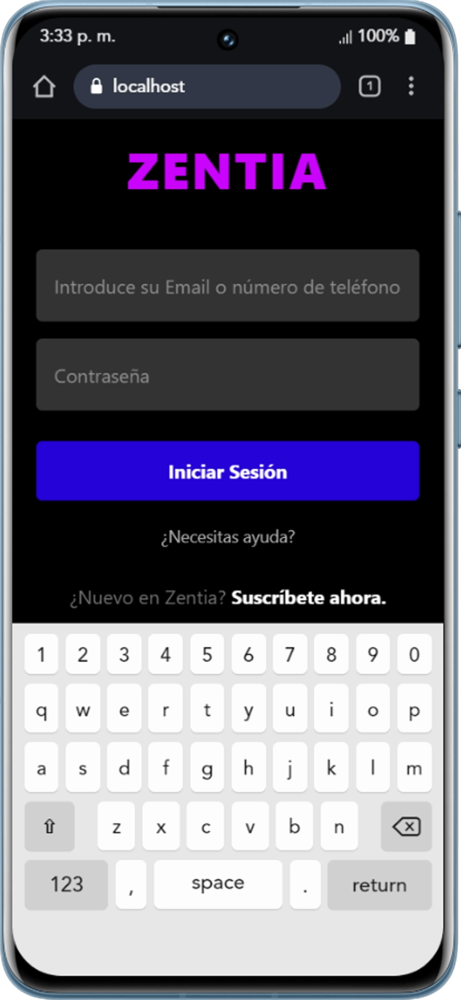
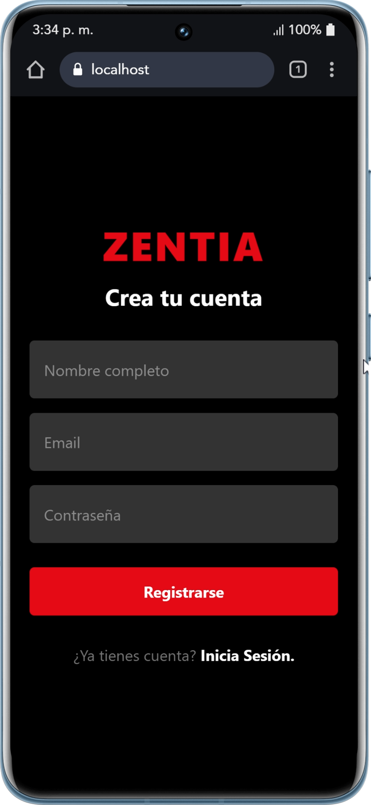
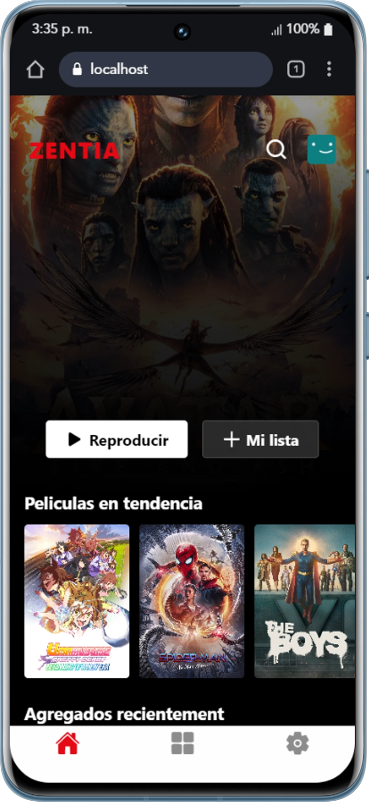
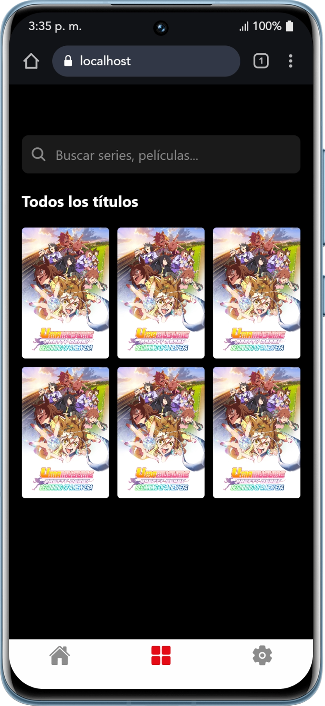
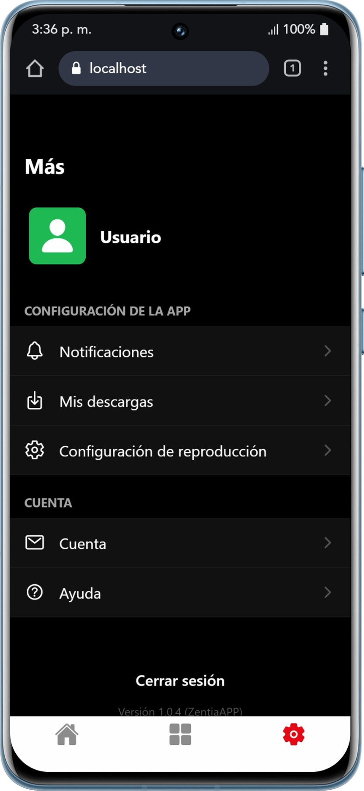

# 🎬 Zentia - Avance de Proyecto Final 01

**Zentia** es una aplicación móvil de streaming inspirada en plataformas líderes como Netflix, desarrollada como parte del curso de Diseño y Desarrollo de Aplicaciones Móviles.
Este primer avance demuestra la base técnica, la arquitectura de navegación y la interfaz de usuario inicial de la plataforma.

---

## 🛠️ Tecnologías y Configación del Entorno

El proyecto ha sido configurado siguiendo buenas prácticas de desarrollo móvil moderno:

- **Framework:** React Native v0.81.5 con Expo SDK v54
- **Lenguaje:** TypeScript v5.9.2
- **Enrutamiento:** Expo Router v6.0.23
- **Navegación:**
  - `@react-navigation/bottom-tabs`
  - `@react-navigation/drawer`

- **Iconografía:** `@expo/vector-icons` (Ionicons)

---

## 📂 Estructura del Proyecto

```text
app/
├── (auth)/             # Flujo de autenticación (Login, Registro)
├── (drawer)/           # Navegación lateral principal
│   └── (tabs)/         # Navegación por pestañas (Catálogo, Home, Ajustes)
├── components/         # Componentes reutilizables
└── constants/          # Configuración global y estilos
```

---

## 🎯 Criterios de Evaluación Cumplidos (Semana 5)

### 🧩 1. Construcción de Interfaz con Componentes Base

Se han implementado interfaces claras utilizando componentes fundamentales de React Native:

- **View y Text:**
  - Layouts oscuros
  - Tipografía blanca para alto contraste

- **Image:**
  - Renderizado de posters mediante URLs externas

- **FlatList:**
  - Grid optimizado de **3 columnas**
  - Renderizado eficiente

---

### 📱 2. Diseño Responsivo y Flexbox

La aplicación se adapta a distintos tamaños de pantalla:

- Uso de **Flexbox**:
  - `flexDirection`
  - `justifyContent`
  - `alignItems`

- Proporcionalidad visual:
  - `aspectRatio: 2/3`

- Mejora UX:
  - `KeyboardAvoidingView`

---

### ⚙️ 3. Interactividad y Manejo de Estado

Se implementó lógica funcional para interacción del usuario:

- **useState:**
  - Manejo de credenciales

- **Eventos:**
  - `onChangeText`
  - `onPress`

- **Validaciones:**
  - `secureTextEntry`
  - `keyboardType="email-address"`

---

### 🧭 4. Navegación Estructurada

Flujo de usuario bien definido:

- **Redirección:**
  - `router.replace`

- **Arquitectura:**
  - `(auth)` → rutas públicas
  - `(drawer)` → rutas privadas

---

## 🚀 Instrucciones de Ejecución

1. **Clonar repositorio:**

```bash
git clone <tu-repo>
cd zentia
```

2. **Instalar dependencias:**

```bash
npm install
```

3. **Iniciar proyecto:**

```bash
npx expo start
```

4. **Ejecutar:**

- Escanear QR con Expo Go
- Usar emulador Android/iOS

---

## 📌 Estado del Proyecto

- ✅ Estructura base implementada
- ✅ Navegación funcional
- ✅ Interfaz inicial completa
- 🔄 Próximos pasos:
  - Integración con API
  - Reproducción de video
  - Persistencia de usuarios

---

## 👨‍💻 Autor

Proyecto desarrollado como parte del curso de Desarrollo de Aplicaciones Móviles.

## Capturas:

- **Pantalla de Login:**
  
- **Pantalla de Register:**
  
- **Pantalla de Inicio:**
  
- **Pantalla de Catalogo:**
  
- **Pantalla de Configuracion:**
  
- **Pantalla de profile:**
  
  - **Pantalla de favorites:**
    
